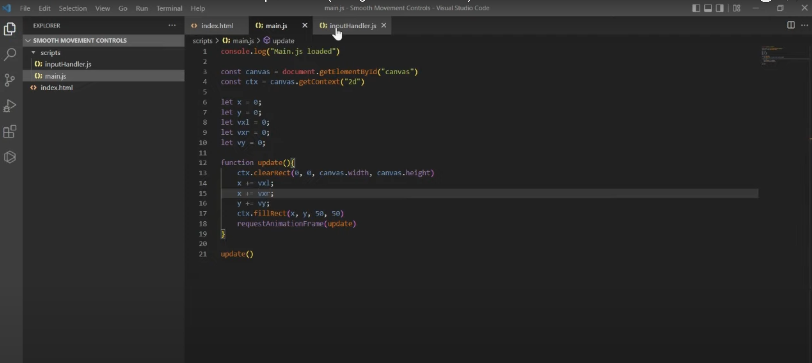

# cwan0042_9103_tu8
# week8_assignment

## Part 1

For this assignment, I chose the "Composition 2." by Piet Mondrian as my source of inspiration (Figure 1). This piece utilizes bold color clashes and orderly lines, confining these restless colors within strict geometric shapes, conveying a sense of confinement. This artwork evokes in me a desire to escape and a longing for freedom, which reminds me of a maze. Figure 2 is a game I found online inspired by Mondrian's style, and I want to learn to combine these elements, merging Mondrian's art style with a maze game to make my interaction more engaging.

# Images
from webpage

# Part 2

As I aim to create a maze, I can build a Mondrian-style labyrinth based on the previous tutorials, using rectangles of varying sizes and colors to construct the maze. However, I still lack a protagonist to escape the maze, so the main technical aspect of this code would teach me how to create a rectangle on the canvas and use the arrow keys to achieve the "escape effect" for the rectangle.

# Images

# Code source
(https://www.youtube.com/watch?v=kX18GQurDQg)

# Blockquotes
> This is a blockquote